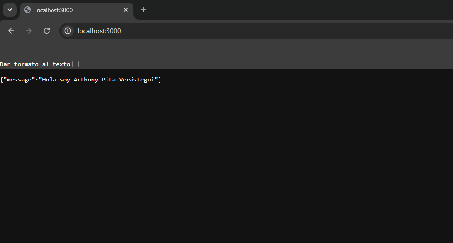
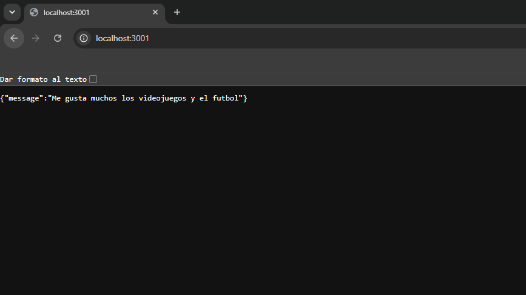
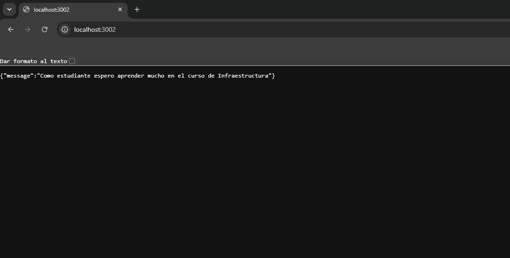

# LABORATORIO 02 

Hoy utilizaremos docker compose para poder desplegar un servicio web y una base de datos, para ello usaremos el siguiente STACK Tecnico:

## 1. API:
   
- **Repositorio:** La presente API se extrajo del repositorio de Dockerhub en cual se puede encontrar en el siguiente enlace https://hub.docker.com/r/nmatsui/hello-world-api.
- **Proceso de despliegue:** La creación de las imagenes y ejecución de contenedores se realiza de forma automatica mediante el archivo "docker-compose.yaml", el cual verifica el archivo Dockerfile de la carpeta api/.
- **Resultado de despliegue:** Al ejecutar docker compose (revisar el apartado de comando para verificar como se ejecuta) se despliega exitosamente las 3 copias de la API en segundo plano, para verificar el despliegue ingrese a las siguientes url: `http://localhost:3000`, `http://localhost:3001`, `http://localhost:3002`

### Imagenes del despliegue en Local:

#### LocalHost: 3000 - Api 01

 

 #### LocalHost: 3001 - Api 02

 

 #### LocalHost: 3002 - Api 03

 

## 2. BD PostgreSQL:

- **Imagen:** postgres:13.
- **Configuración mediante Variables de Entorno:**
  - POSTGRES_DB: Nombre de la base de datos, se usa la variable ${POSTGRES_DB_NAME}.
  - POSTGRES_USER: Usuario de la base de datos, se usa la variable ${POSTGRES_DB_USER}.
  - POSTGRES_PASSWORD: Contraseña de acceso, se usa la variable ${POSTGRES_DB_PASSWORD}.
- **Seguridad:** 
Los valores de estas variables se gestionan de forma segura a través del archivo .env (el cual por obvias razones se prohibe subir al repositorio en github mediante el archivo .gitignore, pero existe un archivo .env.example para ver cuales son las variables de entorno).
- **Uso de Volúmenes:**
  - Se utiliza un volumen gestionado con nombre (`db-data`) montado en la ruta `/var/lib/postgresql/data` del contenedor.
  - Esto garantiza que toda la información registrada en la base de datos no se pierda y persista aun cuando el contenedor sea detenido o removido mediante docker compose down.
  
## 3. Comandos:

- **Para clonar este repositorio se tiene que ejecutar:** git clone https://github.com/anthonyepv-ctrl/Lab-02-DockerCompose 

- **Configurar las variables de entorno:** 
(Windows) copy .env.example .env 
(Linux/MacOS) cp .env.example .env
*Nota: Modificar los datos de las varaibles de entorno a sus datos personales.

- **Despliegue con Docker Compose:** docker compose up -d (Despliega las 3 copias de la API y la BD PostgresSQL en segundo plano).

- **Verificar estado de los contenedores:** docker compose ps

- **Verificar logs de un servicio:** docker compose logs api02

- **Remover los contenedores:** docker compose down 

## 4. Puntos para agregar al README

### Tipos de Redes en Docker

1. **bridge:** Es la red por defecto para los contenedores que se ejecutan en una misma máquina. Proporciona un aislamiento privado y permite que los contenedores se comuniquen entre sí por su dirección IP o por su nombre de servicio gracias al DNS interno de Docker.
2. **host:** El contenedor comparte directamente la interfaz de red del host, eliminando el aislamiento de red entre el contenedor y la máquina anfitriona.
3. **none:** Desactiva completamente la red dentro del contenedor. El contenedor queda sin conexión de red interna ni externa.
4. **overlay:** Utilizado en entornos multihost o clusters con Docker Swarm, permitiendo comunicar contenedores distribuidos en distintas máquinas físicas o virtuales.
5. **macvlan:** Asigna una dirección IP y una dirección MAC física directamente desde la red del host, haciendo que el contenedor aparezca como un dispositivo físico independiente conectado a la red local.

### Tipos de Volúmenes en Docker

Para la persistencia de datos existen los siguientes enfoques:

1. **Volúmenes Gestionados:** Es la forma recomendada por Docker para persistir datos. Son creados y administrados totalmente por Docker dentro de la ruta del host. Son independientes del ciclo de vida del contenedor y garantizan alta velocidad de lectura e escritura.
2. **Bind Mounts:** Identifica directamente una ruta o archivo específico del sistema de archivos local del host dentro de un directorio del contenedor. Se utilizan comúnmente en entornos de desarrollo para reflejar cambios de código en tiempo real.
3. **tmpfs Mounts:** Almacenan los datos únicamente en la memoria RAM de la máquina anfitriona. No se escriben en disco, por lo que desaparecen al detener o eliminar el contenedor.

